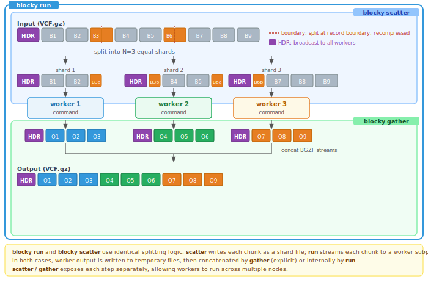

# blocky

Parallelise processing of bgzipped files by splitting along BGZF block boundaries and piping each shard through a tool pipeline concurrently. Works with any BGZF+TBI/CSI file: VCF, BCF, BED, GFF, GTF, TSV, or any newline-delimited bgzipped format.

---

## How it works



A bgzipped file is a sequence of independent BGZF blocks, each containing up to 64 KiB of uncompressed data. Because blocks are self-contained, any block boundary is a valid split point -- the file can be divided into shards without decompressing the data in between.

When an index is present (TBI, CSI, or GZI), blocky uses it to locate block offsets and divide the file into equal-sized shards. Without an index, blocky scans the BGZF blocks directly — this works for any bgzipped file but is slightly slower as the file must be read sequentially to find split points. BCF files always require a CSI index. With `blocky scatter`, each shard file receives a recompressed header and a recompressed boundary block; all blocks in between are byte-copied directly from disk without decompression. With `blocky run`, the shard data is decompressed and streamed to the worker subprocess via stdin.

Only one block per split point is ever decompressed and recompressed. For a file split into N shards, that is N-1 boundary blocks regardless of file size.

---

## Installation

### Precompiled binary (recommended)

Download the latest Linux x86_64 binary from the [latest release](https://github.com/jemunro/blocky/releases/latest):

```bash
curl -fsSL https://github.com/jemunro/blocky/releases/latest/download/blocky -o blocky
chmod +x blocky
mv blocky /usr/local/bin/  # or anywhere on your PATH
```

The binary is statically linked and ~400 kB.

### Docker images

Pre-built images with common bioinformatics tools are available from GHCR:

```bash
docker pull ghcr.io/jemunro/blocky/blocky-bcftools:latest
```

---

## Quick start

```bash
# Split a VCF into 8 shards
blocky scatter -n 8 -o output_{}.vcf.gz input.vcf.gz

# Filter in parallel (4 workers, each processing 2 shards sequentially)
blocky run -n 4 -m 2 -o filtered.vcf.gz input.vcf.gz \
  ::: bcftools view -i "GT='alt'" -Oz

# Tool-managed output: tool writes per-shard files using {} placeholder
blocky run -n 8 input.vcf.gz \
  ::: bcftools view -i "GT='alt'" -Oz -o output.{}.vcf.gz

# Process a BED file
blocky run -n 4 --clamp -o out.bed.gz input.bed.gz ::: cat

# Compress/decompress (like bgzip)
blocky compress input.vcf
blocky decompress input.vcf.gz
```

---

## Subcommands

### `scatter`

Split input into N shards. Each shard is a valid standalone file with its own header.

```
blocky scatter -n <n_shards> -o <output> [options] <input>
```

| Flag | Description |
|---|---|
| `-n`/`--n-shards` | Number of shards (required, >= 1) |
| `-o`/`--output` | Output path template (required). Use `{}` for shard number. |
| `-t`/`--max-threads` | Max threads for scatter (default: min(n, 8)) |
| `--scan` | Ignore index, scan all BGZF blocks (not valid for BCF) |
| `--clamp` | Reduce -n if fewer split points available (instead of erroring) |
| `-v`/`--verbose` | Print progress to stderr |

```bash
blocky scatter -n 4 -o output.{}.vcf.gz input.vcf.gz
# -> output.1.vcf.gz  output.2.vcf.gz  output.3.vcf.gz  output.4.vcf.gz

blocky scatter -n 4 -o output.bcf input.bcf
```

**Index priority**: CSI > TBI > GZI > block scan. BCF requires a CSI index. VCF/text uses whichever index is found; if none, blocks are scanned directly (with a warning).

---

### `run`

Scatter and pipe each shard through a tool pipeline in parallel. Workers pull shards from a shared queue; a concat thread reassembles output in order.

```
blocky run -n <n_workers> [-m <shards_per_worker>] [options] <input> ::: <cmd> [args...]
```

| Flag | Description |
|---|---|
| `-n`/`--n-workers` | Number of concurrent worker pipelines (required, >= 1) |
| `-m`/`--max-shards-per-worker` | Max shards each worker processes sequentially (default: 1) |
| `-o`/`--output` | Output path (optional; absent -> stdout) |
| `-u`/`--uncompressed` | Force uncompressed file output |
| `--discard` | Discard subprocess stdout (tool manages own output) |
| `--discard-stderr` | Discard subprocess stderr |
| `-t`/`--max-threads` | Max scatter threads (default: min(n-workers, 8)) |
| `--scan` | Ignore index, scan all BGZF blocks |
| `--clamp` | Reduce shard count if fewer split points available |
| `--no-kill` | On failure, let sibling shards finish (default: kill them) |
| `-v`/`--verbose` | Print per-shard progress to stderr |

Total shards = `n * m`. Each worker processes up to `m` shards sequentially. The concat thread writes shard outputs to `-o` (or stdout) in order, stripping duplicate headers from shards 2..N.

```bash
# 4 workers, 2 shards each = 8 total shards
blocky run -n 4 -m 2 -o filtered.vcf.gz input.vcf.gz \
  ::: bcftools view -i "GT='alt'" -Oz

# Output to stdout (no -o)
blocky run -n 4 input.vcf.gz ::: bcftools view -Ov | wc -l

# Force uncompressed output
blocky run -n 4 -u -o filtered.vcf input.vcf.gz \
  ::: bcftools view -Ov
```

**Subprocess stdin** is always decompressed (raw bytes). The interceptor thread detects the subprocess output format (BGZF or uncompressed) and handles header stripping and recompression automatically.

---

### `gather`

Concatenate pre-existing shard files into a single output. Raw block copy with header stripping on shards 2..N.

```
blocky gather [-o <output>] [options] <shard1> [<shard2> ...]
```

| Flag | Description |
|---|---|
| `-o`/`--output` | Output path (optional; absent -> stdout) |
| `-v`/`--verbose` | Print progress to stderr |

```bash
blocky gather -o merged.vcf.gz shard_*.vcf.gz
blocky gather shard_*.vcf.gz | bcftools stats
```

For VCF/BCF, the `#CHROM` line is validated byte-for-byte across all shards before writing. A mismatch exits with code 1 and no partial output is written.

---

### `compress` / `decompress`

BGZF compression and decompression using blocky's libdeflate engine. Output is compatible with `bgzip` and `htslib`. Matches `bgzip` behavior: the input file is removed after successful operation.

```
blocky compress   [-c] [file]
blocky decompress [-c] [file]
```

| Flag | Description |
|---|---|
| `-c`/`--stdout` | Write to stdout, keep original file |

```bash
blocky compress data.vcf       # -> data.vcf.gz (removes data.vcf)
blocky decompress data.vcf.gz  # -> data.vcf (removes data.vcf.gz)
cat data.vcf | blocky compress -c | blocky decompress -c  # pipe mode
```

Errors if the output file already exists. Warns if compressing an already-compressed file or decompressing a non-compressed file.

These subcommands are included for convenience, e.g. on systems without htslib.

---

## `{}` placeholder and `--discard`

`{}` in the tool command is replaced with the zero-padded shard number. This works in all modes -- you can use `{}` for auxiliary output files (reports, logs) while still capturing stdout via `-o`.

```bash
# Tool manages its own output files -- use --discard to drop stdout
blocky run -n 8 --discard input.vcf.gz \
  ::: bcftools view -Oz -o output.{}.vcf.gz

# {} for auxiliary files, stdout captured to -o
blocky run -n 4 -o annotated.vcf.gz input.vcf.gz \
  ::: vep --stats_file report.{}.html
```

To pass a literal `{}` to a tool, escape as `\{}` (use single quotes: `'\{}'`).

| `-o` | `--discard` | Mode |
|---|---|---|
| Yes | No | File output (concat thread writes to `-o`) |
| No | No | Stdout output |
| No | Yes | Discard stdout (tool manages own output) |
| Yes | Yes | Error (mutually exclusive) |

---

## Output file naming

`{}` in the `-o` template is replaced with the zero-padded shard number:

```
-o output.{}.vcf.gz, -n 8   ->  output.1.vcf.gz ... output.8.vcf.gz
-o /results/{}/out.bcf       ->  /results/1/out.bcf ... /results/4/out.bcf
```

Parent directories are created automatically.

---

## Supported formats

| Format | Index | Notes |
|--------|-------|-------|
| bgzipped VCF (`.vcf.gz`) | TBI, CSI, or GZI | Auto-scan if no index (with warning) |
| BCF (`.bcf`) | CSI required | No scan fallback |
| BED, GFF, GTF, TSV (`.bed.gz`, `.gtf.gz`, etc.) | TBI, CSI, or GZI | `#`-prefixed header lines stripped automatically |

Format is detected from file content (magic bytes), not from extension. Any BGZF file with `#`-prefixed headers works out of the box.

---

## Pipeline separator

`:::` (or `---`) separates pipeline stages. Stages are joined with `|` and executed via `sh -c`.

```bash
blocky run -n 8 -o out.vcf.gz input.vcf.gz \
  ::: bcftools view -i "GT='alt'" -Ou \
  ::: bcftools view -s Sample -Oz
```

---

## Performance

- With `blocky scatter`, middle BGZF blocks are byte-copied at disk bandwidth with no decompression; `blocky run` decompresses all blocks to stream raw bytes to workers
- Only N-1 boundary blocks are decompressed per scatter (one per split point)
- Worker pool model: `-n` workers pull from a shared shard queue, keeping all cores busy even when shard processing times vary
- Tmp shard files are BGZF-compressed (saves disk), decompressed on-the-fly during concat if `-u` is set
- For CPU-heavy tools (VEP, GATK), combine blocky's `-n` with the tool's own threading

---

## Limitations

- BCF requires a CSI index (`bcftools index input.bcf`). No scan fallback for BCF.
- Tools must read from stdin and write to stdout (or use `{}` for tool-managed output).
- Format conversion (VCF <-> BCF) is the pipeline's responsibility.
- BAM/CRAM are explicitly not supported -- reads span block boundaries, making block-level splitting produce incorrect results.

---

## Contributing

Pull requests are welcome. Please follow these guidelines:

- **CI must pass.** All PRs run the test suite automatically via GitHub Actions.
- **Add tests for new features.** New functionality should include tests in the appropriate `tests/test_*.nim` file. Bug fixes should add a regression test where practical.
- **Run tests locally before pushing:** `nimble test` (requires `bcftools`, `bgzip`, and `tabix` on `PATH`).
- **Keep changes focused.** One feature or fix per PR. Avoid unrelated refactoring in the same PR.
- **No new dependencies** without prior discussion.

### Building from source

```bash
git clone --recurse-submodules https://github.com/jemunro/blocky
cd blocky
nimble build              # debug build
nimble release            # release build (optimised, stripped)
nimble test               # run all tests
nim c -r tests/test_scatter.nim   # run a single test file
```

**Build requirements:** Nim >= 2.0, cmake, a C compiler (gcc or clang).

**Test requirements:** `bcftools`, `bgzip`, `tabix` (from htslib). Test fixtures are generated automatically on first run via `tests/generate_fixtures.sh`.

---

Blocky started as a Python prototype and was built into a portable, statically-linked Nim binary using [Claude Code](https://claude.ai/code).
